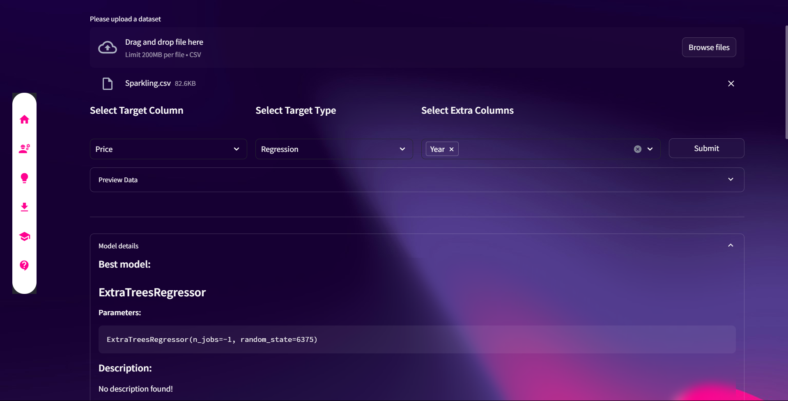

# SwiftML: Automated Machine Learning Web Interface


A powerful Streamlit-based web interface for PyCaret that democratizes machine learning by enabling users to build, evaluate, and deploy ML models through an intuitive browser interface - no coding required.



## Live Demo

Experience SwiftML directly in your browser: [https://swiftml.onrender.com/](https://swiftml.onrender.com/)

## ✨ Features

- **Automated Machine Learning**: Automatically finds the best ML algorithms for your dataset
- **User-Friendly Interface**: Intuitive web-based interface requiring no programming knowledge
- **Comprehensive Model Evaluation**: Rigorous testing and validation of selected models
- **Multiple Data Format Support**:
  - CSV files (with more formats coming soon)
- **Model Export**: Download your trained models for deployment
- **Collaboration Friendly**: Share insights and results with team members

## 🚀 Quick Start

### Prerequisites

Before installing SwiftML, ensure you have the following installed:

- **Git**: [Download here](https://git-scm.com/downloads)
- **Python 3.11**: [Download here](https://www.python.org/downloads/)  
  **Important**: Python 3.11 is required for compatibility with PyCaret and related dependencies

### Windows Installation

1. **Clone the Repository**
   ```bash
   git clone https://github.com/yourusername/SwiftML.git
   cd SwiftML
   ```

2. **Run the Automated Installer**
   - Double-click `Install.bat` to automatically set up all dependencies
   - Wait for the installation to complete (may take several minutes)

3. **Launch the Application**
   - Double-click `Run.bat` to start the web server
   - Keep the command window open while using the application

4. **Access the Web Interface**
   - Open your web browser and navigate to: `http://localhost:2907`
   - Start building machine learning models!

## 📖 How to Use

1. **Upload Your Dataset**: Click the upload button to provide your CSV file
2. **Configure Settings**: Select your target variable and model preferences
3. **Run Automation**: Let SwiftML automatically find the best algorithm for your data
4. **Evaluate Results**: Review model performance metrics and comparisons
5. **Download Model**: Export your trained model for deployment

## 🛠️ Technical Architecture

SwiftML combines several powerful technologies:

- **Frontend**: Streamlit for responsive web interface
- **Automated ML**: PyCaret for model selection and optimization
- **Data Processing**: Pandas and NumPy for data manipulation
- **Visualization**: Plotly and Matplotlib for results display


**SwiftML** - Making Machine Learning Accessible to Everyone 🚀
